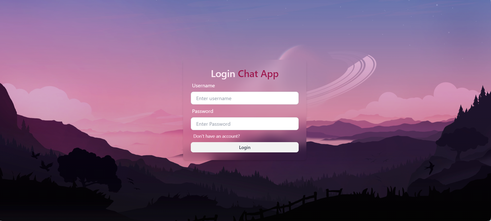
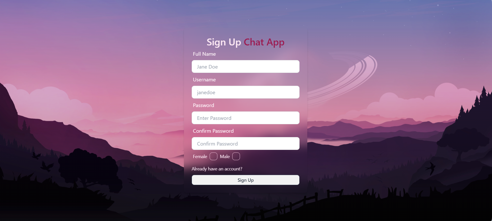
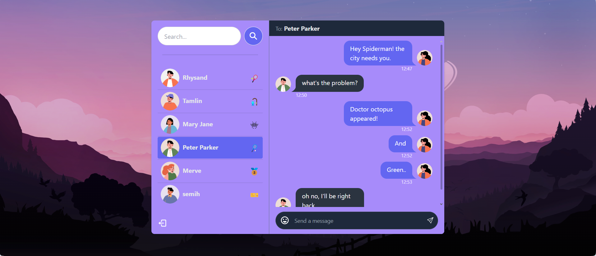
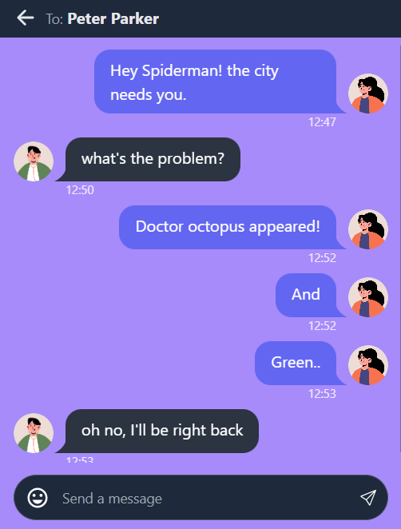

# MERN Stack Chat Application

A real-time chat application built with the MERN stack (MongoDB, Express.js, React, Node.js) featuring user authentication and real-time messaging capabilities.

## Overview

This chat application enables users to communicate in real-time with features like instant messaging, secure authentication, and a responsive design that works on both desktop and mobile devices.

## Features

- Real-time messaging with Socket.IO
- User authentication with JWT
- Responsive design for all devices
- Modern UI with Tailwind CSS and DaisyUI
- State management using Zustand
- Toast notifications for better UX

## Technologies Used

### Frontend

- **React**: Frontend library for building the UI
- **Vite**: Build tool
- **Tailwind CSS & DaisyUI**: Styling
- **Socket.IO Client**: Real-time communication
- **React Router**: For client-side routing
- **Zustand**: State management
- **React Hot Toast**: Notifications
- **React Icons**: Icon library

### Backend

- **Node.js**: JavaScript runtime environment for backend
- **Express.js**: Web framework for building APIs
- **MongoDB & Mongoose**: NoSQL database and object data modeling (ODM)
- **Socket.IO**: Real-time functionality
- **JWT**: Authentication
- **bcryptjs**: Password hashing
- **Cookie Parser**: Cookie handling

### Screenshoots

